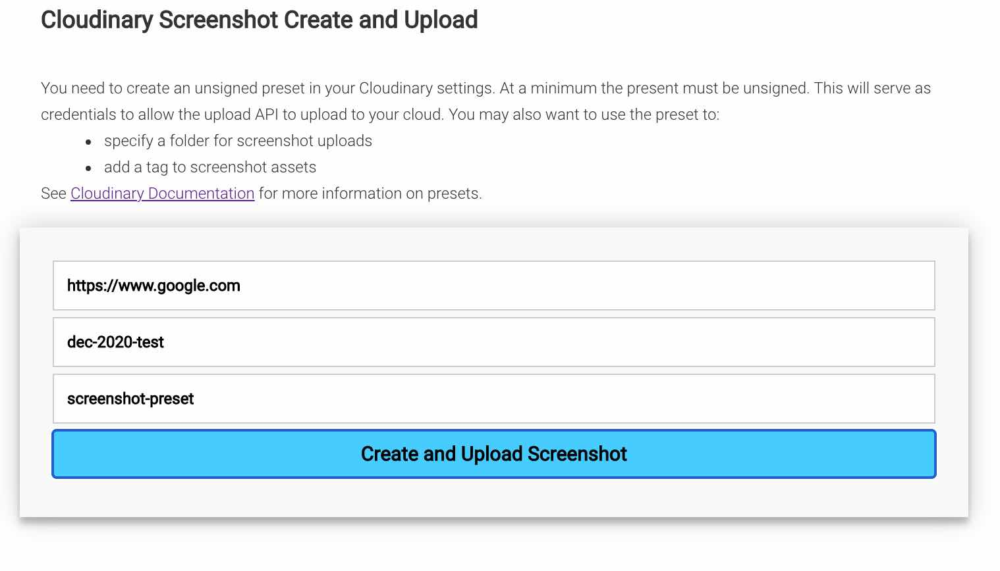
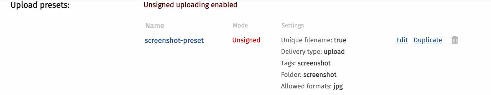

# Cloudinary Screenshot Upload
Use a Netlify custom function to create a screenshot with Node.js using Puppeteer.  Return a base64 string to the client.  Client posts the screenshot to a Cloudinary cloud account using an unsigned preset for credentials.

## Form 
Capture web page to screenshot, unsigned preset and Cloudinary cloud name



The function can be reconfigured to post to Cloudinary using the Node.js SDK if it should only go to a single Cloudinary account and the function is authenticated or behind a firewall.

## local server
```bash
netlify dev
```

## Netlify Deploy

Set up an account on Netlify and link to a Github repo.

```bash
netlify deploy 
netlify deploy --prod
```

https://cld-screenshot-create-upload.netlify.app//.netlify/functions/hello
https://cld-screenshot-create-upload.netlify.app//.netlify/functions/screenshot

https://medium.com/@viviancpy/save-screenshot-of-websites-with-puppeteer-cloudinary-and-heroku-1-3-bba6082d21d0

## Cloudinary Preset

The image below shows an unsigned preset.  Besides authorizing an unsigned upload, this preset will also place the uploaded asset in a folder named "screenshot", add a tag named "screenshot" and only allow file with a `png` format to be uploaded.
