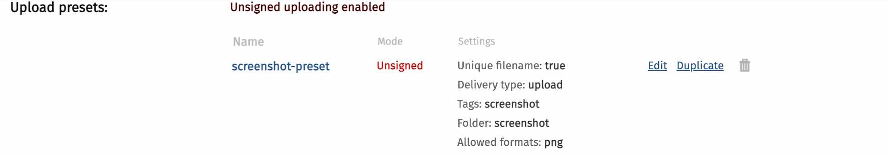

# custom serverless function

https://itnext.io/how-to-build-and-deploy-serverless-functions-to-netlify-d37418f6f7be


## local server
```bash
netlify dev
```

http://localhost:64319/.netlify/functions/hello


## netlify server

```bash
netlify deploy 
netlify deploy --prod
```

https://custom-function.netlify.app/.netlify/functions/hello
https://custom-function.netlify.app/.netlify/functions/screenshot

https://medium.com/@viviancpy/save-screenshot-of-websites-with-puppeteer-cloudinary-and-heroku-1-3-bba6082d21d0

## Cloudinary Preset

The image below shows an unsigned preset.  Besides authorizing an unsigned upload, this preset will also place the uploaded asset in a folder named "screenshot", add a tag named "screenshot" and only allow file with a `png` format to be uploaded.
